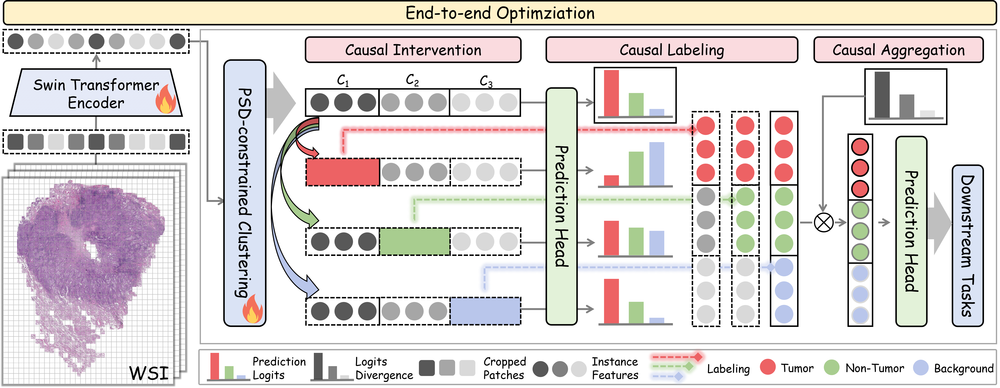

# C^4MIL: An End-to-End Causality-Enhanced Multiple Instance Adaptive Clustering Framework 

## :fire: News

- [2025/07/15] Our manuscript was currently submitted to _IEEE International Conference on Bioinformatics and Biomedicine (BIBM)_.

## :rocket: Pipeline

Here's an overview of our **Manifold-constrained Adaptive Clustering (MacNet)** method:

Here's some exciting experimental results of both active interpretbility and passive interpretabiity that explain both decision-making process and outcome contribution:

## :mag: TODO
**We are currently organizing all the code. Stay tuned!**
- [x] training code
- [x] Evaluation and Visualization code
- [x] Model code
- [ ] Pretrained weights
